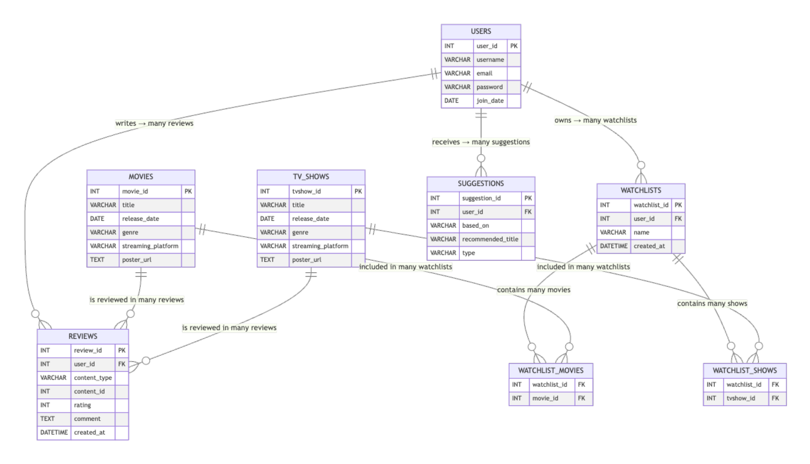
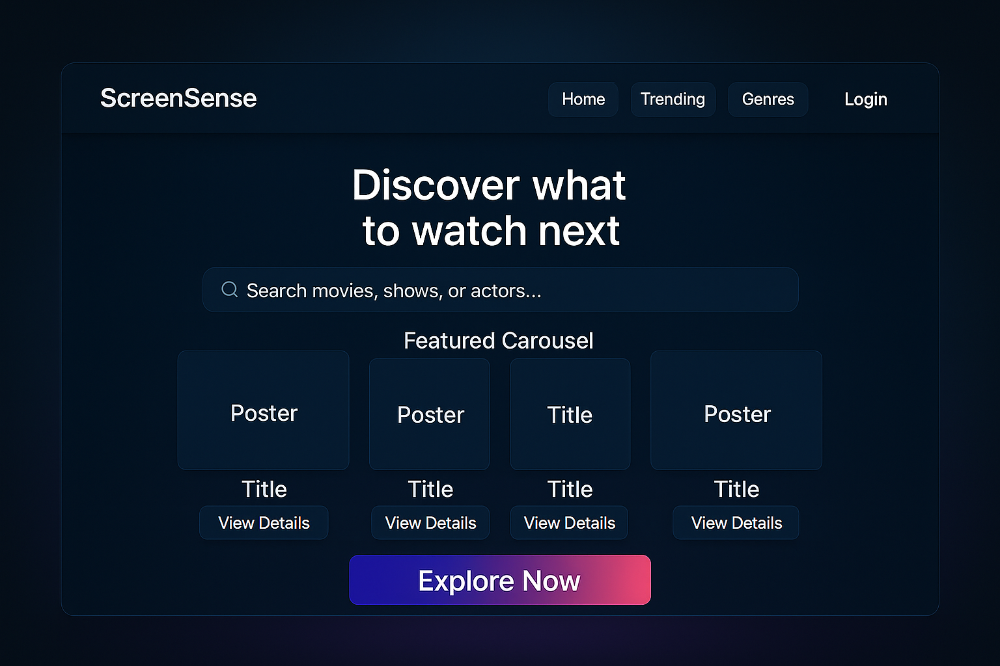
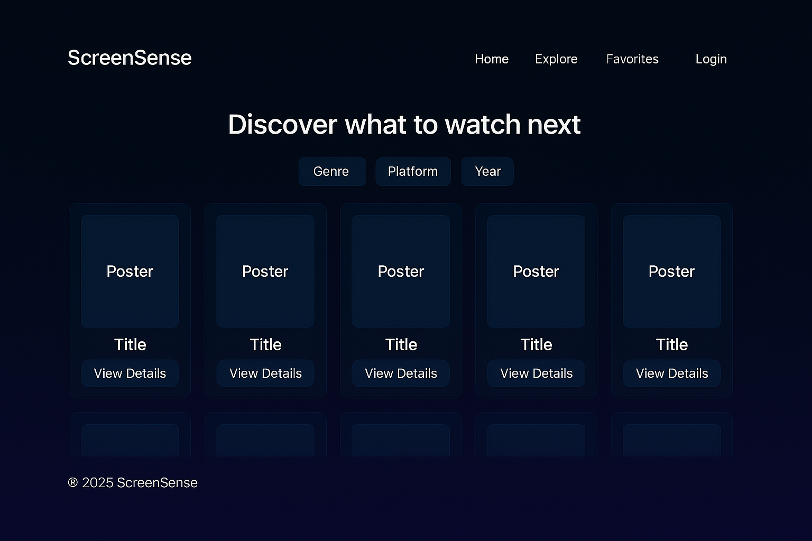
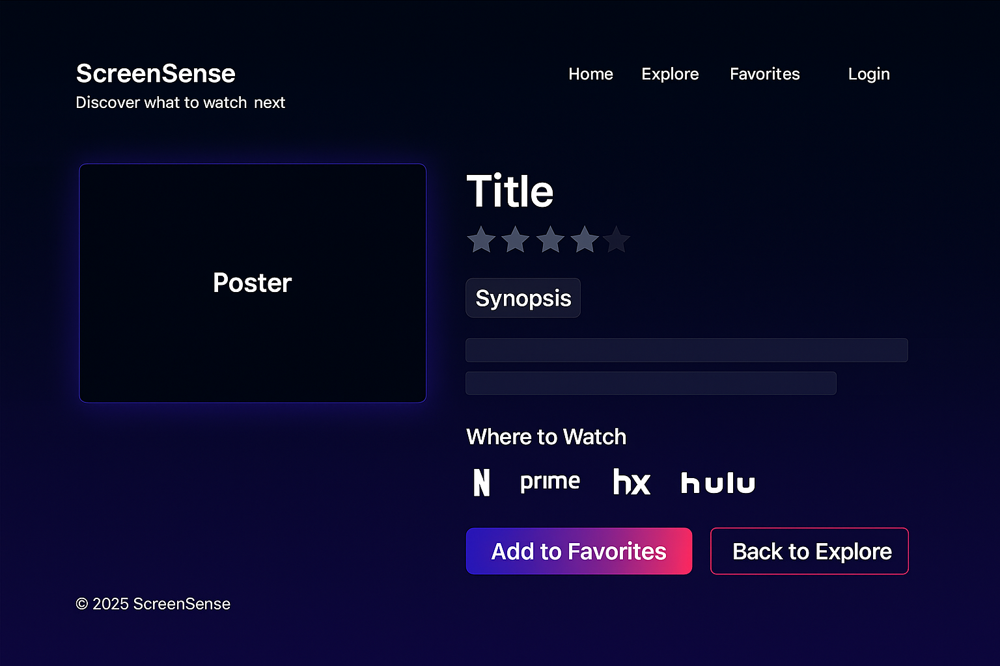
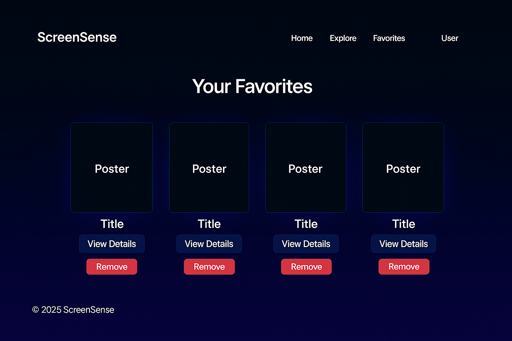
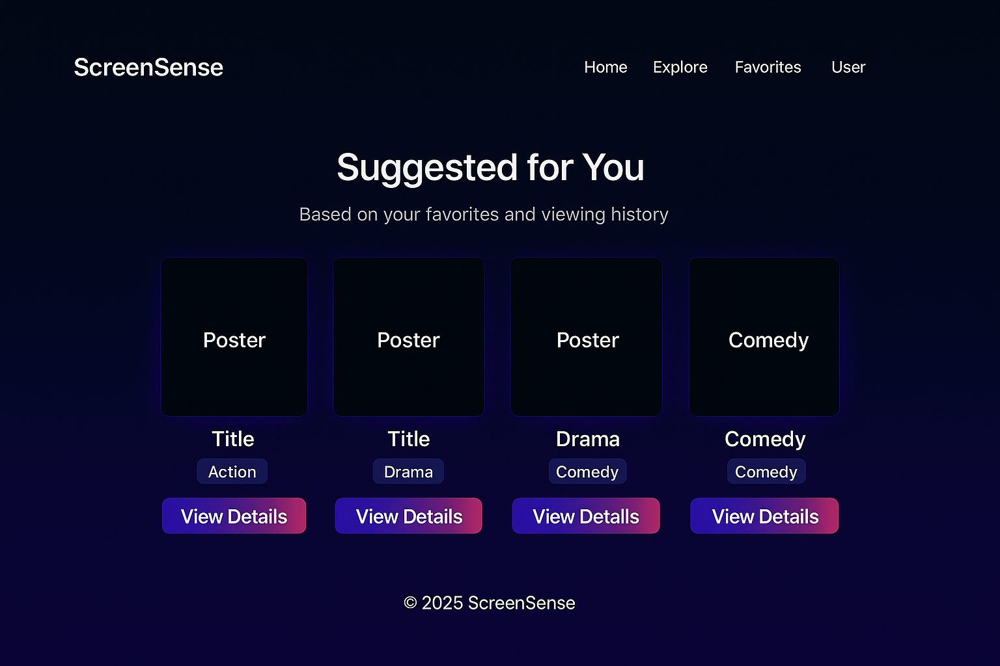
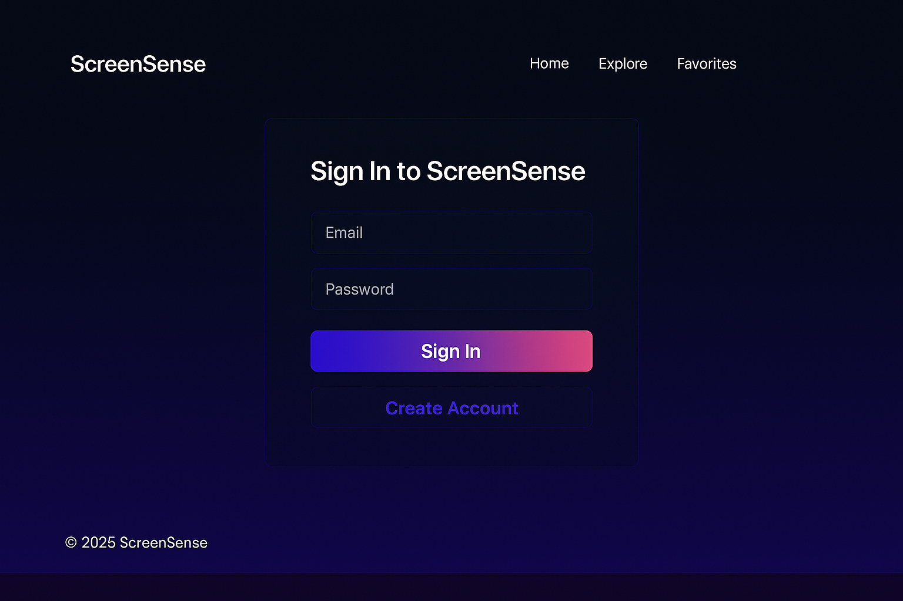

# ScreenSense

## Project Overview

**ScreenSense** is a movie and TV show discovery platform that allows users to explore trending titles, view detailed information, and save their favorite content — all in one centralized hub.  
The goal of ScreenSense is to help users decide _what to watch next_ by providing an organized and visually engaging experience that integrates live data from a movie database API.

Users can browse popular titles, filter results by genre or platform, read summaries, and manage personalized favorites. Once signed in, ScreenSense tailors recommendations based on the user’s selections.

---

## MVP (Minimum Viable Product)

The **MVP** of ScreenSense will include:

- **Search Functionality:** Users can search for movies or TV shows by title.
- **Explore Page:** Displays filtered results (by genre, platform, or year).
- **Details Page:** Shows each title’s poster, synopsis, genre, and where to watch.
- **Favorites Page:** Logged-in users can save and remove favorites.
- **Suggestions Page:** Generates personalized recommendations based on saved favorites.
- **User Authentication:** Allows users to register, sign in, and access saved content.

---

## Stretch Goals

If time allows, potential stretch goals may include:

- Advanced filtering (by rating, runtime, or language).
- Watchlist tracking or completion status.
- User reviews or comments section.

---

## Technologies to Be Used

- Django (Python)
- Django ORM
- PostgreSQL
- HTML, CSS, JavaScript
- Django Templates

**External API Integration:**

- The Movie Database (TMDB) API

---

## Core Features Breakdown

| Feature                    | Description                                                                   |
| -------------------------- | ----------------------------------------------------------------------------- |
| **Home / Landing Page**    | Introductory page with a search bar and featured titles.                      |
| **Explore / Results Page** | Grid view showing movies and TV shows that match filters.                     |
| **Details Page**           | Displays detailed information such as synopsis, genre, rating, and platforms. |
| **Favorites Page**         | Allows signed-in users to view and manage saved titles.                       |
| **Suggestions Page**       | Recommends similar titles based on user favorites.                            |
| **Login / Signup Page**    | Provides account creation and authentication functionality.                   |

---

## ERD

## Wireframes

### Home / Landing

### Explore / Results

### Details

### Favorites

### Suggestions

### Login / Signup

---

## Goal

To build a functional and visually cohesive movie discovery platform that demonstrates:

- API integration within Django
- CRUD functionality through user interactions
- Authentication and session handling
- A clean and intuitive user experience

[Trello Board](https://trello.com/b/ypQfmlVJ/screensense)
